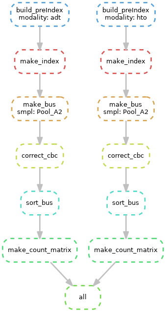

# scc-proc
Upstream processing for single cell ADT-based sequencing (including hashtags)

## Necessary files

### 1) `config.yaml` file
Example configuration is shown below.

- This file must be at the same level as the `Snakefile`.
- Multiple samples can be added to the config assuming they follow the same antibody mixture and bead setup.
- All fastq files must be in the fastq_dir path
    - Specific filenames are provided in the `samples` attribute of the yaml file that correspond to ADT or HTO files
    - Order of fastq files in the `samples` attribute corresponds to the `cbc`, `umi`, `tag` numbering system (refer to kallisto documentation).

```
dirs:
  fastq_dir: "/home/user/fastq"
  out_dir: "/home/user/run/adtHto_processing/scc_proc_out"
files:
  adt_catalog: "/home/user/run/totalseqA_barcodes.csv"
  hto_catalog: "/home/user/run/totalseqAHashtag_barcodes.csv"
  allowlist: "/home/user/run/3M-february-2018.rc.txt"
general_settings:
  threads: 4
  modes: ["adt", "hto"]
  cbc: [0,0,16]
  umi: [0,16,28]
  tag: [1,0,15]
samples:
  - name: Pool_A2
  adt_fastqs: ["Pool_A2_ADT_S1_R1_001.fastq.gz", "Pool_A2_ADT_S1_R3_001.fastq.gz"]
  hto_fastqs: ["Pool_A2_HTO_S4_R1_001.fastq.gz", "Pool_A2_HTO_S4_R3_001.fastq.gz"]
```

### 2) fastq files
Refer to config above

### 3) Antibody file
Comma separted file with barcodes and descriptions. Example below:

```
CD40,CTCAGATGGAGTATG
CD44,AATCCTTCCGAATGT
CD48,CTACGACGTAGAAGA
CD21,AACCTAGTAGTTCGG
```

### 4) Allowlist cell barcode file
Allowlist file containing accepted cell barcodes. One per line. Example below:

```
GTCTGCTATGTCTA
GATGATGCATAGAA
```

## Setup
1. Create conda env
```
conda create --name <env> --file environment_osx.txt
```

2. Run Snakemake
```
snakemake --cores 4
```
The overall process will look like this:



3. Downstream analysis of your own choosing. The count matrix and corresponding row/col info will be found in `{sample_name}_{modality}_output_count/`

## Credits
- [Conda](https://docs.conda.io/en/latest/)
- [Snakemake](https://snakemake.readthedocs.io/en/stable/)
- [Kallisto](https://pachterlab.github.io/kallisto/)
- [Kallisto KITE featureMap.py](https://github.com/pachterlab/kite/tree/master/featuremap)
- [Bustools](https://github.com/BUStools/bustools)
- [kallisto | bustools KITE protocol](https://bustools.github.io/BUS_notebooks_R/10xv3.html)
    - I made my Snakemake pipeline heavily based on their pipeline.
